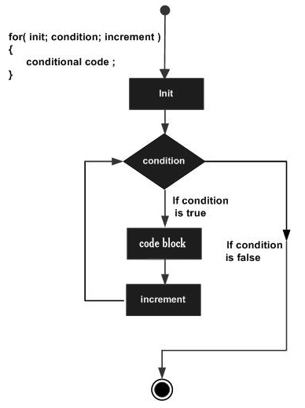
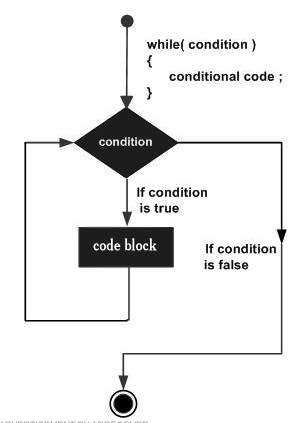
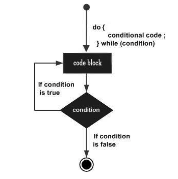

# For loop

The syntax for c++ for loop is:

```cpp
for ( init; condition; increment ) {
   statement(s);
}
```

Here, `statement(s)` may be a single statement or a block of statements. The control flows as follows:

* The `init` step is executed first, and only once. This step allows us to declare and initialize any loop control variables. We are not required to put a statement here, as long as a semicolon appears.

* Next, the `condition` is evaluated. If it is `true`, the body of the loop is executed. If it is `false`, the body of the loop does not execute and flow of control jumps to the next statement just after the for loop.

* After the body of the for loop executes, the flow of control jumps back up to the `increment` statement. This statement can be left blank, as long as a semicolon appears after the condition.

* The `condition` is now evaluated again. If it is true, the loop executes and the process repeats itself (body of loop, then increment step, and then again condition). After the condition becomes `false`, the for loop terminates.

The flow diagram:



The nested syntax is as follows:

```cpp
for ( init; condition; increment ) {
   for ( init; condition; increment ) {
      statement(s);
   }
   statement(s);
}
```

# For each loop

There’s a simpler and safer type of loop called a `for-each` loop (also called a `range-based` for-loop) for cases where we want to iterate through every element in an array (or other list-type structure). The `for-each` loop has the following syntax:

```cpp
for (element_declaration : array)
   statement(s);
```

When this statement is encountered, the loop will iterate through each element in `array`, assigning the value of the current `array` element to the variable declared in `element_declaration`. For best results, `element_declaration` should have the same type as the `array` elements, otherwise type conversion will occur.

```cpp
int main()
{
    // Initialize
    std::string colour[4] = {"Blue", "Red", "Orange", "Yellow"};

    for (const auto &element : colour) // Each element is a const (immutable) reference to the currently iterated array element
    {
        std::cout << element << std::endl;
    }
    return 0;
}
```

In the example above:

* The `auto` keyword ensures that the type of the variable that is being declared will automatically be deducted from its initializer. The variable declared with `auto` keyword should be initialized at the time of its declaration only or else there will be a compile-time error. 

* A variable can be declared as a reference by putting `&` in the declaration. The element will be a reference to the currently iterated array element, avoiding having to make a copy. Therefore, any changes to the element will affect the original array that is iterated over, something not possible if element is a normal variable.

* The reference is also `const` since we are intending to use the array in a read-only fashion.

# While loop

The c++ syntax for while is similar to that of R:

```cpp
while(condition) {
   statement(s);
}
```

The `condition` may be any expression, and `true` is any non-zero value. The loop iterates while the condition is `true`. The flow diagram is as follows:



The nested syntax is as follows:

```cpp
while(condition) {
   while(condition) {
      statement(s);
   }
   statement(s);
}
```

# Do while loop

The `do...while` loop checks its condition at the bottom of the loop. Simply put, the `do...while` loop is similar to a while loop, except that a `do...while` loop is guaranteed to execute at least one time.

```cpp
do {
   statement(s);
} 
while(condition);
```

Because the conditional expression appears at the end of the loop, the `statement(s)` in the loop execute once before the condition is tested. If the `condition` is `true`, the flow of control jumps back up to `do`, and the `statement(s)` in the loop execute again. This process repeats until the given `condition` becomes `false`. The `do...while` loop has the following flow diagram:



The nested syntax is as follows:

```cpp
do {
   statement(s); 
   do {
      statement(s);
   } while(condition);

} while(condition);
```